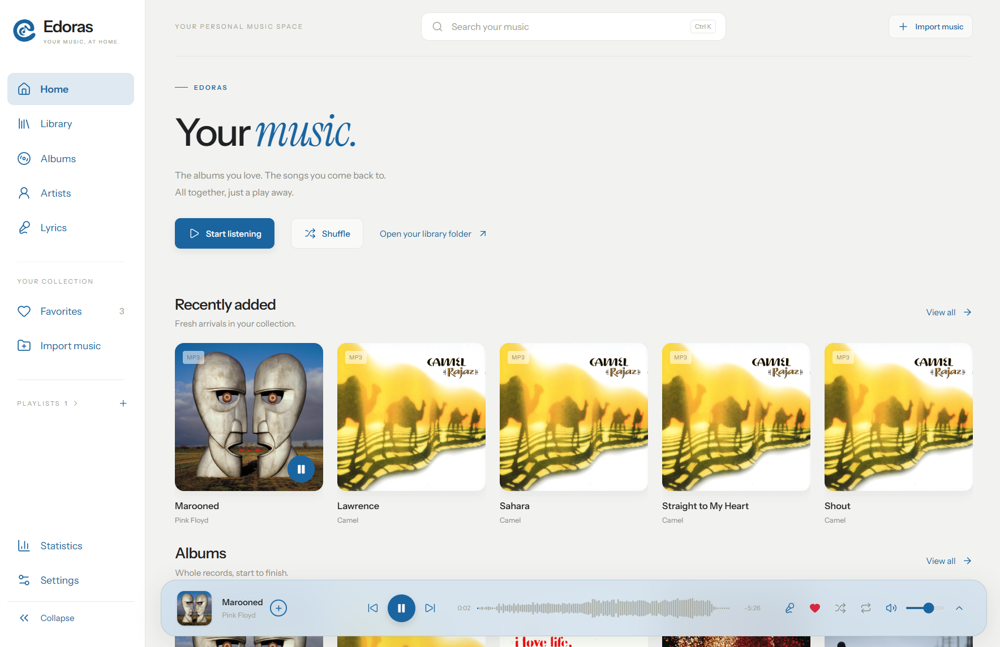
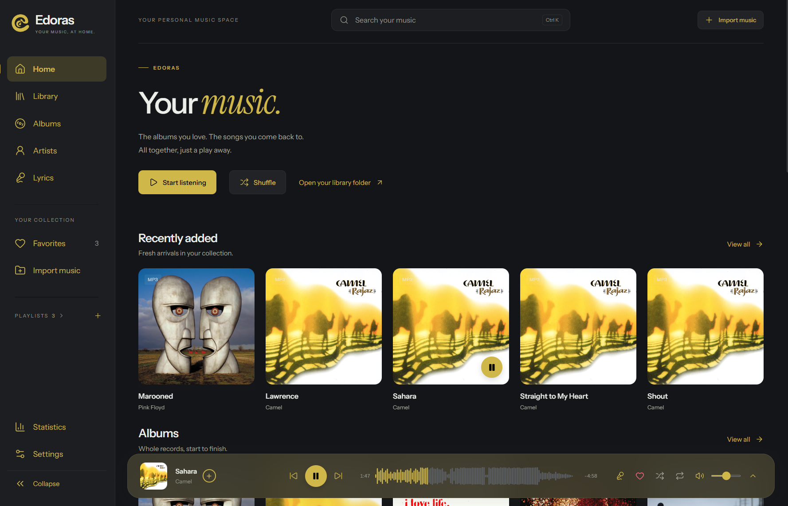
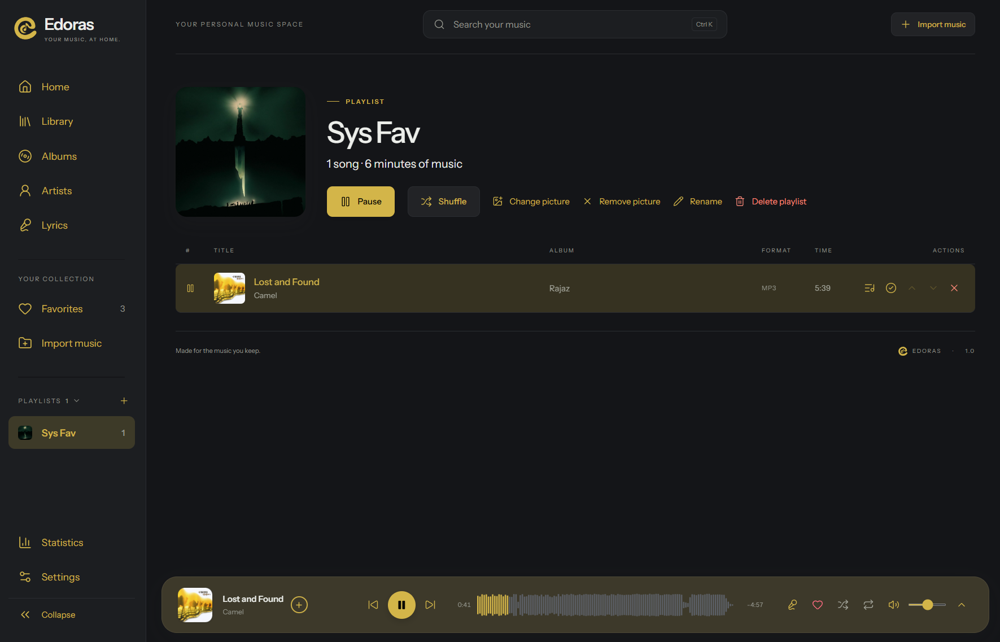
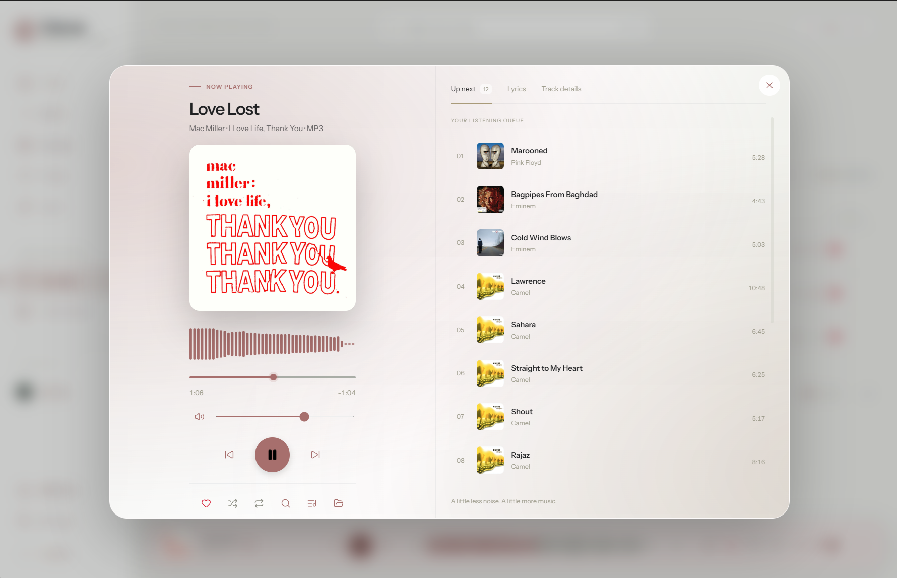
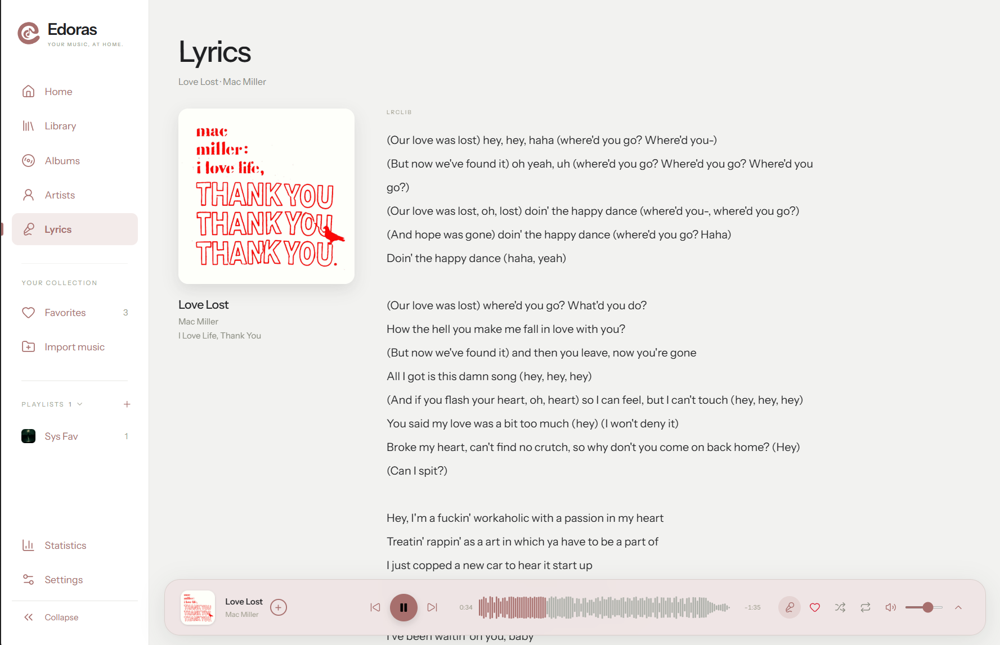
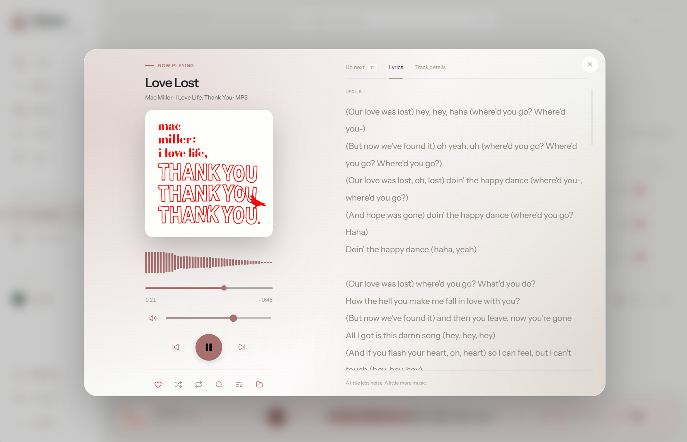
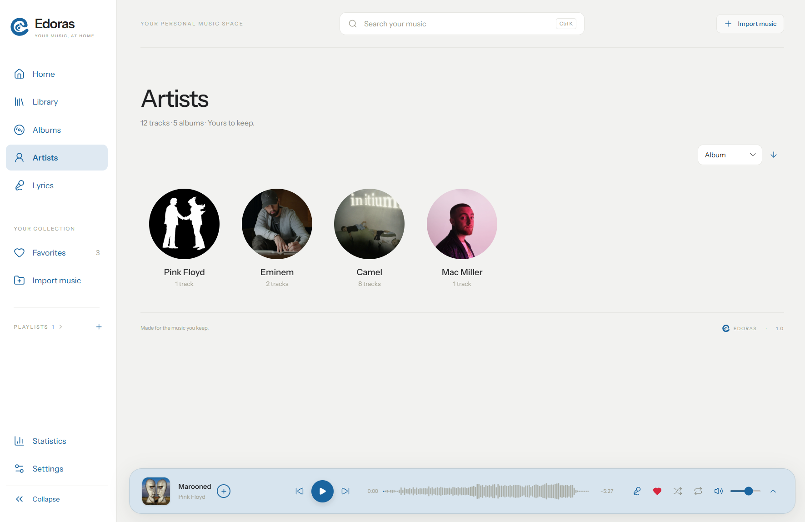
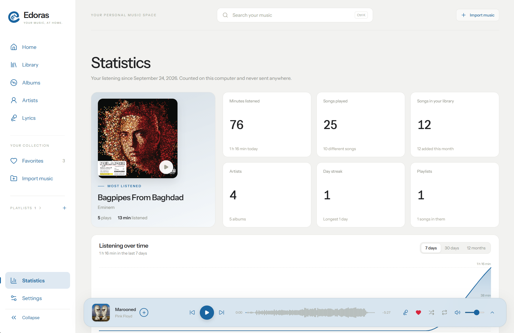
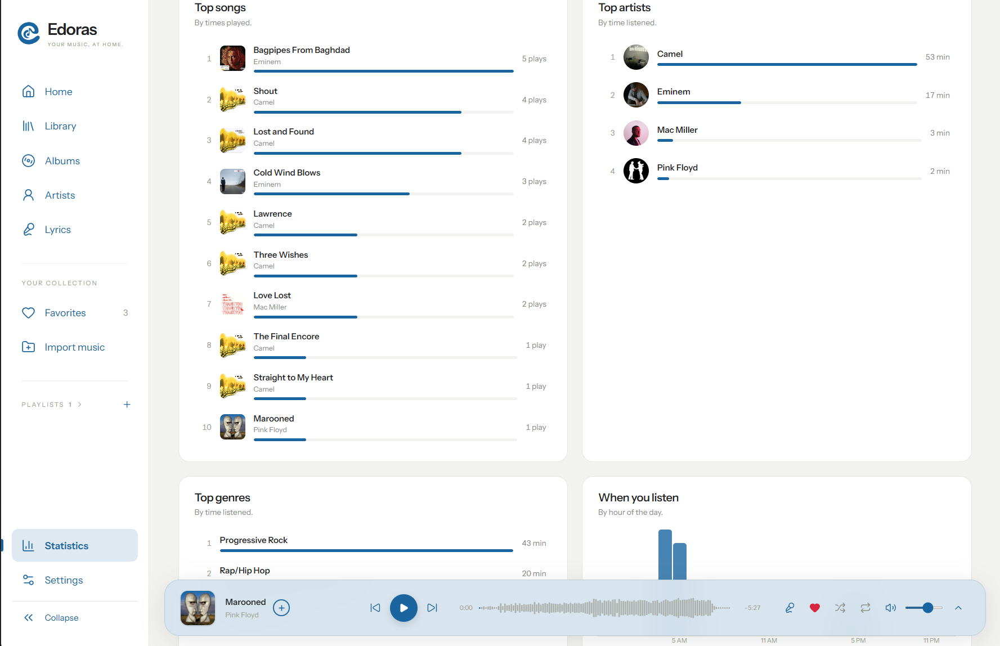

<div align="center">
  
  <h1>Edoras</h1>
  <p>Your music, at home.</p>
  <p>A local-first music player for Windows.</p>
  <p><a href="https://github.com/Syst4n/edoras/releases/latest"><strong>Download for Windows</strong></a></p>
</div>

## Get started

1. Open the [latest release](https://github.com/Syst4n/edoras/releases/latest) and download **Edoras-1.0.0-Windows-Setup.exe**.
2. Run the installer. Choose an install folder if you want, then launch Edoras from the Start menu or desktop shortcut.
3. Click **Import music** to add files or folders, or copy music into **Edoras Library** in your Windows Music folder. You can choose a different library folder in Settings.

The installer is for **Windows 10/11, 64-bit x64**. It is unsigned, so Windows may show an unknown-publisher warning. The [portable EXE](https://github.com/Syst4n/edoras/releases/latest) runs without installing, but does not register **Open with** for audio files. Windows 32-bit is not supported by the Electron version used here; an ARM64 build has not been tested.

## See it

<p align="center"></p>
<p align="center"><em>Home in light mode, with recently added music and the waveform player.</em></p>

<p align="center"></p>
<p align="center"><em>Home in dark mode.</em></p>

<p align="center"></p>
<p align="center"><em>A playlist with custom artwork and playback controls.</em></p>

### Light mode and lyrics

<p align="center"></p>
<p align="center"><em>The full player and listening queue in light mode.</em></p>

<p align="center"></p>
<p align="center"><em>Artwork and lyrics on their own page.</em></p>

<p align="center"></p>
<p align="center"><em>Lyrics beside the full player.</em></p>

### Artists and statistics

<p align="center"></p>
<p align="center"><em>Browse artists by the album artist in your music metadata.</em></p>

<p align="center"></p>
<p align="center"><em>Listening time, plays, library size, artists, streaks and playlists.</em></p>

<p align="center"></p>
<p align="center"><em>Top songs, artists, genres and listening times.</em></p>

## What Edoras does

- **Keep your music in one place.** Import individual songs or folders, or put files anywhere inside your library folder. Edoras watches the folder for additions and moves. Imports copy outside files; they do not remove the originals.
- **Play and organize.** Browse songs, albums and artists; search and sort your library; make playlists with custom pictures; mark favorites; use a queue, shuffle and repeat. Play an album, artist or playlist from its page.
- **Browse artists from metadata.** Edoras groups songs by album artist from their embedded or fetched metadata. Sort your collection by artist, album, release date or title, and add artist photos with an online lookup.
- **Enjoy the details.** The player shows a whole-track waveform and picks its accent color from the current cover. Light and dark themes are available.
- **Fetch missing metadata.** Search by song name or use **Fetch Library Metadata** to look up the collection. Matches can add song details, album artwork and artist photos from Deezer, Apple Music, MusicBrainz and Wikimedia. The library-wide fetch only applies confident matches automatically; choose a result yourself when a song needs a closer look.
- **Identify a song by sound.** Use **Identify by sound** when a filename or tag is not enough. Edoras sends a short acoustic fingerprint, not the audio file, to an unofficial identification service; availability can change.
- **Find lyrics automatically during a metadata fetch.** Edoras reads embedded lyrics on import. When you choose an online metadata match or run the library-wide fetch, it also looks for lyrics through LRCLIB and saves any match for display on the Lyrics page or inside Now Playing. You can retry the lookup or paste your own words.
- **See your listening history.** Statistics shows listening time, plays, streaks, top songs, artists and genres, plus trends over time. History stays in your chosen library folder on this computer.
- **Use your own formats.** MP3, FLAC, WAV, M4A, AAC, OGG, Opus, AIFF, WMA, ALAC, APE, WavPack and audio in MP4/MKA containers can be imported. FFmpeg is bundled for formats Windows cannot play directly. DRM-protected or damaged files may not play.

Edoras has no account, streaming catalog, analytics or music upload. It does not make online requests on startup, import or playback. Online metadata and lyrics lookups begin when you choose a fetch or identification action. Embedded tags and your audio files are not rewritten by a metadata lookup.

## Your files

By default, Edoras creates **Edoras Library** in your Windows Music folder. Your playlists, artwork, listening history and catalog are stored in its hidden `.edoras` subfolder. Change the library location in Settings. Switching locations does not move or delete the previous library.

Deleting a song **inside** the library through Edoras sends that file to the Windows Recycle Bin. Deleting a playlist does not delete its songs.

## For developers

Install Node.js 22 or newer, then run:

```powershell
npm ci --include=dev
npm start
```

`npm start` builds and opens the desktop app. `npm run dev` is only a browser preview; importing and playback through the native bridge require the desktop app.

```powershell
npm run build
npm test
npm run test:desktop
npm run test:v1
npm run test:final
npm run dist
```

`npm run dist` creates the installer and portable EXE in `release/`. The desktop tests use disposable music libraries and do not touch your own collection.

## License and third-party software

Edoras source code is licensed under [GPL-2.0-only](LICENSE). [Third-party notices](THIRD_PARTY_NOTICES.md) identify the included software and the online services Edoras can contact. The separately bundled FFmpeg executable is GPL v3; its license and exact build information are in [licenses](licenses). The source used for that FFmpeg build is identified in `licenses/FFmpeg-BUILD.txt`.
